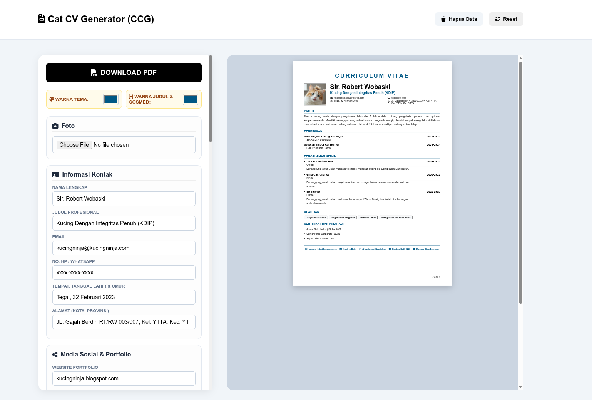
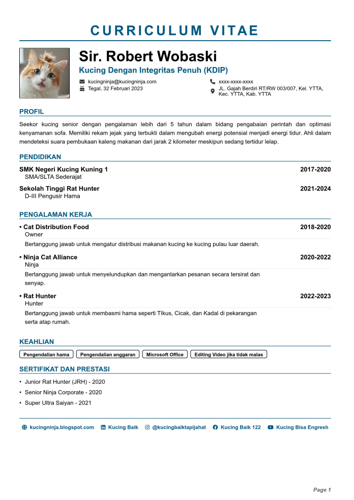

# 🐾 Cat CV Generator (CCG)



**Cat CV Generator (CCG)** is a sleek, client-side web application designed to help users (and their feline friends) create professional resumes instantly. Despite the playful name, this tool is a robust CV builder that prioritizes ease of use, clean design, and data privacy.

Built with a focus on simplicity, it uses a single-page architecture where you can edit your details on the left and see a live, high-fidelity preview on the right.

---

## ✨ Key Features

* **Live Interactive Preview:** See your CV update in real-time as you type, formatted for a professional A4 layout.
* **Built-in Image Cropper:** Integrated with *Croppie.js* to allow users to upload and crop profile photos directly within the app.
* **Auto-Save Functionality:** Leverages *LocalStorage* to ensure your progress is saved automatically; no data is lost upon refreshing the page.
* **Dynamic Theme Customization:** Easily change accent and title colors using a built-in color picker to match your personal brand.
* **Smart Multi-page Rendering:** Includes a custom rendering engine that automatically calculates content height and distributes it across multiple pages if necessary.
* **High-Resolution PDF Export:** Generate and download a clean PDF file using *html2canvas* and *jsPDF* with a single click.
* **Clean Architecture:** Written in Vanilla JavaScript, HTML5, and CSS3 without the need for heavy frameworks.

---

## 🛠️ Technical Stack

* **Frontend:** HTML5, CSS3 (with CSS Variables for theming), and Vanilla JavaScript.
* **PDF Generation:** [jsPDF](https://github.com/parallax/jsPDF) and [html2canvas](https://html2canvas.hertzen.com/).
* **Image Processing:** [Croppie](https://foliotek.github.io/Croppie/) for square-viewport cropping.
* **Icons:** [Font Awesome 6.4.0](https://fontawesome.com/).

---

## 🚀 How to Use



1.  **Clone the repository:**
    ```bash
    git clone [https://github.com/your-username/cat-cv-generator.git](https://github.com/your-username/cat-cv-generator.git)
    ```
2.  **Open `index.html`** in any modern web browser.
3.  **Fill in your details:** Enter your contact info, professional summary, work experience, and skills.
4.  **Customize:** Upload your photo and pick your preferred theme colors.
5.  **Download:** Hit the **DOWNLOAD PDF** button to save your resume.

---

## 📜 License

This project is open-source and free to use for personal or educational purposes.

---
*Created with ❤️ for humans and cats who want to get hired.*
